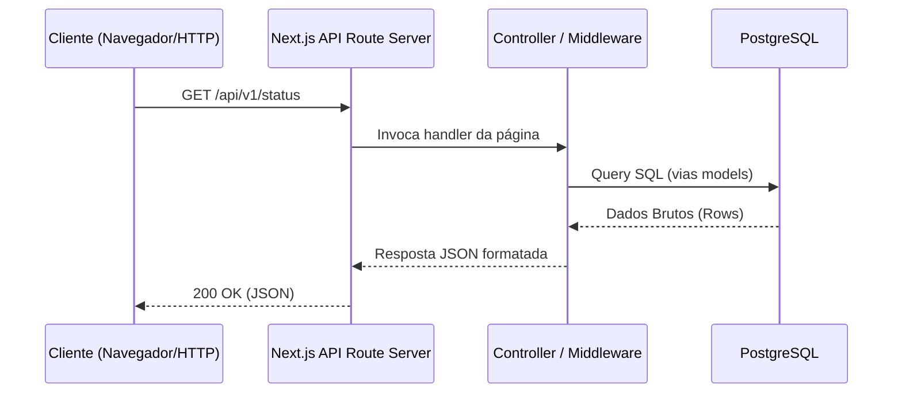

# Tecnologias e Arquitetura do Projeto `clone-tabnews`

Este documento apresenta o detalhamento técnico e arquitetural de **todas** as tecnologias, bibliotecas, ferramentas de infraestrutura, linters, runners de teste e automações presentes neste repositório.

Para cada tecnologia, a explicação é estruturada em 5 pilares:

1. **Explicação geral**: O que é e qual o seu papel no ecossistema.
2. **Problema**: Qual dor técnica ou necessidade arquitetural ela resolve.
3. **Solução**: Como a ferramenta resolve essa dor de forma eficiente.
4. **Explicação técnica profunda**: Como funciona internamente, fluxo de dados, integrações no projeto e tradeoffs.
5. **Boas práticas**: Padrões de mercado e como está aplicada neste repositório.

---

## Sumário

- [1. Framework & Runtime Core](#1-framework--runtime-core)
  - [1.1 Node.js (`.nvmrc`)](#11-nodejs-nvmrc)
  - [1.2 Next.js](#12-nextjs)
  - [1.3 React \& React DOM](#13-react--react-dom)
- [2. Banco de Dados \& Camada de Persistência](#2-banco-de-dados--camada-de-persistência)
  - [2.1 PostgreSQL](#21-postgresql)
  - [2.2 `pg` (node-postgres)](#22-pg-node-postgres)
  - [2.3 `node-pg-migrate`](#23-node-pg-migrate)
- [3. Backend, Resiliência \& Roteamento](#3-backend-resiliência--roteamento)
  - [3.1 `next-connect`](#31-next-connect)
  - [3.2 `async-retry`](#32-async-retry)
- [4. Data Fetching no Cliente](#4-data-fetching-no-cliente)
  - [4.1 `swr`](#41-swr)
- [5. Infraestrutura \& Automação de Serviços](#5-infraestrutura--automação-de-serviços)
  - [5.1 Docker \& Docker Compose](#51-docker--docker-compose)
  - [5.2 Script de Prontidão (`wait-for-postgres.js`)](#52-script-de-prontidão-wait-for-postgresjs)
- [6. Configuração de Ambiente](#6-configuração-de-ambiente)
  - [6.1 `dotenv` \& `dotenv-expand`](#61-dotenv--dotenv-expand)
  - [6.2 `.editorconfig`](#62-editorconfig)
- [7. Suíte de Testes \& Concorrência](#7-suíte-de-testes--concorrência)
  - [7.1 Jest](#71-jest)
  - [7.2 `eslint-plugin-jest`](#72-eslint-plugin-jest)
  - [7.3 `concurrently`](#73-concurrently)
- [8. Qualidade de Código (Linters \& Formatters)](#8-qualidade-de-código-linters--formatters)
  - [8.1 ESLint \& `eslint-config-next`](#81-eslint--eslint-config-next)
  - [8.2 Prettier \& `eslint-config-prettier`](#82-prettier--eslint-config-prettier)
- [9. Git Workflow \& Commits Semânticos](#9-git-workflow--commits-semânticos)
  - [9.1 Husky](#91-husky)
  - [9.2 `@commitlint/cli` \& `@commitlint/config-conventional`](#92-commitlintcli--commitlintconfig-conventional)
  - [9.3 Commitizen (`cz-conventional-changelog`)](#93-commitizen-cz-conventional-changelog)

---

## 1. Framework & Runtime Core

### 1.1 Node.js (`.nvmrc`)

#### 1. Explicação geral

O **Node.js** é o ambiente de execução (runtime) JavaScript assíncrono e orientado a eventos no lado do servidor, construído sobre o motor V8 do Google Chrome. O arquivo `.nvmrc` define a versão exata do Node.js recomendada para o projeto (`lts/hydrogen`, que mapeia para a versão LTS Node 18).

#### 2. Problema

Em equipes de desenvolvimento ou ambientes de CI/CD (Continuous Integration), diferentes desenvolvedores podem ter versões distintas de Node.js instaladas localmente (ex: Node 16, 20 ou 22). Isso causa o clássico problema "na minha máquina funciona", onde divergências de comportamento na API de runtime ou incompatibilidade de pacotes npm geram bugs silenciosos em produção.

#### 3. Solução

Ao definir a versão no `.nvmrc`, gerenciadores como o NVM (Node Version Manager) ou fnm ajustam automaticamente o ambiente para usar a versão padrão do projeto (`nvm use`), garantindo paridade absoluta entre desenvolvimento e testes.

#### 4. Explicação técnica profunda

O Node.js executa em uma única thread (Event Loop) delegando operações de E/S (Input/Output), como conexões de rede com o PostgreSQL ou leitura de arquivos, para a libuv via threads do SO. A escolha da versão LTS (Long Term Support) `hydrogen` (v18) garante estabilidade, suporte estendido a correções de segurança e suporte nativo a APIs como `fetch` sem necessidade de polyfills.

#### 5. Boas práticas

- Sempre versionar a versão do Node no `.nvmrc`.
- Utilizar versões LTS em projetos de produção para mitigar vulnerabilidades e quebras por atualizações instáveis.

---

### 1.2 Next.js

#### 1. Explicação geral

O **Next.js** (versão `16.2.10`) é um framework React fullstack que provê renderização no servidor (Server-Side Rendering - SSR), geração estática (Static Site Generation - SSG), roteamento baseado em arquivos (`pages/` ou `app/`) e endpoints de API (`pages/api`).

#### 2. Problema

Aplicações React puras (Single Page Applications - SPAs cliente-side com Vite ou Create React App) sofrem com dois grandes problemas:

1. **SEO deficiente**: O HTML inicial vem praticamente vazio (`<div id="root"></div>`), dependendo do navegador baixar e executar todo o pacote JavaScript para renderizar o conteúdo.
2. **Arquitetura fragmentada**: Necessidade de criar e gerenciar um servidor Express/Fastify separado em outro repositório para expor endpoints da API.

#### 3. Solução

O Next.js unifica a camada de visualização (React) e a camada de API (Node.js) na mesma estrutura de projeto. As rotas HTTP em `pages/api/` funcionam como rotas de backend serverless ou Node traduzidas automaticamente pelo Next.js.

#### 4. Explicação técnica profunda

No repositório `clone-tabnews`, utiliza-se o modelo de roteamento `pages/`. Cada arquivo em `pages/api/v1/` (ex: `pages/api/v1/status/index.js`) é compilado como um endpoint assíncrono Node.js que recebe os objetos HTTP nativos `req` (`NextApiRequest`) e `res` (`NextApiResponse`).

Fluxo de uma requisição API no Next.js:



#### 5. Boas práticas

- Separar lógica de controle (`controllers`) e regras de dados (`models`) dos arquivos de página em `pages/api/`, aplicando o padrão **MVC**.
- Não expor segredos ou variáveis privadas do backend no lado do cliente.

---

### 1.3 React & React DOM

#### 1. Explicação geral

O **React** (`v19.2.7`) é a biblioteca para construção de interfaces de usuário baseada em componentes reativos e no modelo declarativo. O **React DOM** é o pacote responsável por renderizar a árvore de componentes React no DOM (Document Object Model) do navegador.

#### 2. Problema

Manipular o DOM diretamente com JavaScript puro (`document.createElement`, `appendChild`) para UIs complexas é propenso a erros, ineficiente em performance e gera código imperativo difícil de manter.

#### 3. Solução

O React introduz o conceito de **DOM Virtual**. Quando o estado de um componente altera, o React compara a nova árvore virtual com a anterior (processo chamado de _Reconciliation_ ou _Diffing_) e aplica no DOM real apenas as alterações necessárias.

#### 4. Explicação técnica profunda

A versão `19` do React introduz melhorias no compilador e na hidratação de componentes renderizados no servidor. No modelo de hidratação do Next.js:

1. O servidor renderiza a estrutura inicial HTML estática.
2. O React DOM no cliente baixa o bundle de script e conecta os event listeners aos nós HTML já existentes na página ("Hidratação").

#### 5. Boas práticas

- Manter componentes limpos de regras de negócio complexas.
- Reutilizar componentes de interface de forma atômica e composível.

---

## 2. Banco de Dados & Camada de Persistência

### 2.1 PostgreSQL

#### 1. Explicação geral

O **PostgreSQL** é um sistema gerenciador de banco de dados relacional objeto (ORDBMS) open-source extremamente robusto, conhecido por sua conformidade estrita com padrões SQL e garantia das propriedades **ACID** (Atomicidade, Consistência, Isolamento e Durabilidade). No projeto, roda via container Docker (`postgres:16.0-alpine3.18`).

#### 2. Problema

Aplicações reais precisam persistir dados com segurança e integridade transacional. Soluções de armazenamento não relacionais ou em memória (como arquivos locais ou JSON) não oferecem suporte adequado a relacionamentos de dados complexos, concorrência segura ou garantias contra corrupção de dados em eventuais falhas do sistema.

#### 3. Solução

O PostgreSQL entrega alta performance em queries complexas, forte consistência de dados através de constraints (Foreign Keys, Unique Indexes, Check Constraints) e suporte nativo a migrações transacionais.

#### 4. Explicação técnica profunda

O container roda a versão 16 baseada na distribuição Linux leve Alpine. A porta `5432` do container é exposta para a máquina host local. O PostgreSQL gerencia as conexões aceitando conexões TCP/IP e alocando workers dedicados por processo para cada sessão de cliente SQL.

#### 5. Boas práticas

- Nunca alterar o banco diretamente em produção sem utilizar scripts de migração versionados.
- Isolar o banco de desenvolvimento em um ambiente containerizado com volumes separados.

---

### 2.2 `pg` (node-postgres)

#### 1. Explicação geral

O `pg` (`v8.22.0`) é o driver não-bloqueante nativo do PostgreSQL para Node.js. Ele fornece os métodos fundamentais para conexão TCP, envio de queries SQL e gerenciamento de Pool de Conexões (`pg.Pool`).

#### 2. Problema

O Node.js precisa de uma forma de se comunicar com a porta `5432` do PostgreSQL enviando comandos em bytecode/SQL via protocolo do Postgres. Criar uma nova conexão socket TCP a cada requisição HTTP recebida na API traz um custo proibitivo de latência (handshake TCP + autenticação no Postgres), além de estourar rapidamente o limite de conexões ativas do banco (`max_connections`).

#### 3. Solução

O pacote `pg` implementa o conceito de **Connection Pool** (`Pool`). Em vez de abrir e fechar conexões para cada query, o `pg` mantém um número configurável de conexões abertas prontas para uso. Quando a aplicação precisa rodar uma query, ela "pega emprestada" uma conexão livre do pool, executa a query e devolve a conexão para o pool.

#### 4. Explicação técnica profunda

No módulo `infra/database.js`, encapsula-se o envio de consultas via `query()`.

Exemplo de abstração segura com `pg`:

```javascript
import { Client } from "pg";

async function query(queryObject) {
  let client;
  try {
    client = await getNewClient();
    const result = await client.query(queryObject);
    return result;
  } catch (error) {
    console.error(error);
    throw error;
  } finally {
    await client?.end();
  }
}
```

_Tradeoff e Cuidado_: Ao usar `Client` individual ou `Pool`, é fundamental garantir o fechamento da conexão no bloco `finally`. Caso contrário, ocorrerá o sintoma de **Connection Leak** (vazamento de conexões), travando a API assim que todas as conexões ficarem presas.

#### 5. Boas práticas

- Sempre utilizar **Parameterized Queries** (consultas parametrizadas, ex: `SELECT * FROM users WHERE id = $1`) para evitar vulnerabilidades gravíssimas de **SQL Injection**.
- Tratar a desconexão e erros no bloco `try...finally`.

---

### 2.3 `node-pg-migrate`

#### 1. Explicação geral

O `node-pg-migrate` (`v8.0.4`) é uma ferramenta de linha de comando e biblioteca para gerenciamento de migrações de esquema de banco de dados (Database Migrations) no PostgreSQL utilizando Node.js.

#### 2. Problema

À medida que um sistema evolui, tabelas são criadas, colunas são alteradas e índices são adicionados. Se cada desenvolvedor alterar o banco local manualmente via PGAdmin ou DBeaver, o banco de cada ambiente ficará totalmente desalinhado e a implantação em produção será imprevisível e manual.

#### 3. Solução

As migrações tratam o banco de dados como código versionado (Schema-as-Code). Cada alteração de esquema é salva em um arquivo JS/SQL com um timestamp ou número sequencial em `infra/migrations/`. O `node-pg-migrate` executa as migrações em ordem estrita e registra quais já foram rodadas em uma tabela de controle no Postgres (`pgmigrations`).

#### 4. Explicação técnica profunda

Comandos npm associados no `package.json`:

- `npm run migrations:create`: Gera um novo arquivo de migração dentro da pasta `infra/migrations`.
- `npm run migrations:up`: Lê a variável `DATABASE_URL`, compara quais migrações ainda não foram aplicadas lendo a tabela `pgmigrations` e executa as migrações faltantes dentro de uma única transação SQL (`BEGIN; ... COMMIT;`). Se uma falhar, o rollback é automático.

#### 5. Boas práticas

- Toda mudança na estrutura de dados deve ter um arquivo de migração correspondente.
- As migrações devem ser escritas de forma a permitir rollback e execução determinística.

---

## 3. Backend, Resiliência & Roteamento

### 3.1 `next-connect`

#### 1. Explicação geral

O `next-connect` (`v1.0.0`) é uma biblioteca leve de roteamento e middleware para Next.js API Routes. Ela permite organizar Handlers de rotas HTTP com sintaxe semelhante ao Express/Connect (`router.get()`, `router.post()`, `router.use()`).

#### 2. Problema

Nativamente, uma rota de API do Next.js aceita apenas uma função genérica `handler(req, res)`. Para tratar diferentes métodos HTTP (GET, POST, DELETE), o código virava um grande bloco condicional `switch(req.method)` desorganizado. Além disso, capturar erros não tratados e implementar middlewares globais exigia repetição manual em todas as rotas.

#### 3. Solução

O `next-connect` provê uma abstração limpa:

- Encadeamento de métodos HTTP (`.get()`, `.post()`, `.delete()`).
- Tratamento centralizado de erros via callback `onError`.
- Tratamento de rotas não encontradas via callback `onNoMatch`.

#### 4. Explicação técnica profunda

No módulo `infra/controller.js`, configura-se o handler padrão usando `createRouter()`:

```javascript
import { createRouter } from "next-connect";

const router = createRouter();

export default router.use(onError);
```

Quando uma requisição atinge a rota API, o `next-connect` intercepta o fluxo, executa a pilha de middlewares atribuídos via `.use()`, direciona para a função equivalente ao método da requisição e, caso ocorra qualquer exceção assíncrona não capturada (`Promise rejection`), ela é enviada automaticamente para a função `onError`.

#### 5. Boas práticas

- Centralizar a conversão de exceções em códigos de status HTTP apropriados (400, 404, 422, 500) dentro do handler `onError` no Controller.

---

### 3.2 `async-retry`

#### 1. Explicação geral

O `async-retry` (`v1.3.3`) é uma biblioteca que adiciona resiliência a chamadas assíncronas no Node.js, executando automaticamente novas tentativas (retries) em operações que falharam por instabilidade temporária.

#### 2. Problema

Em arquiteturas de microsserviços ou ambientes containerizados, um serviço (como o PostgreSQL ou uma API externa) pode demorar alguns milissegundos adicionais para iniciar durante o boot da aplicação ou apresentar uma oscilação de rede transitória. Se o sistema tentar se conectar apenas uma vez e falhar imediatamente, o processo todo quebra (crash).

#### 3. Solução

O `async-retry` encapsula qualquer função que retorne uma `Promise` e a reexecuta caso ocorra um erro, aplicando estratégias configuráveis como **Backoff Exponencial** (espera um intervalo cada vez maior entre as tentativas) até atingir o limite estipulado.

#### 4. Explicação técnica profunda

No arquivo `infra/database.js`, a conexão inicial ao banco utiliza o `async-retry` para garantir tolerância a falhas caso o container Postgres ainda esteja subindo no momento em que uma consulta seja iniciada.

Exemplo conceitual de uso no projeto:

```javascript
import retry from "async-retry";

await retry(
  async () => {
    // Tenta conectar ao banco
  },
  {
    retries: 5,
    maxTimeout: 1000,
  },
);
```

#### 5. Boas práticas

- Não aplicar retries ilimitados em operações que não são idempotentes (ex: pagamentos).
- Configurar timeouts máximos para evitar travamento indefinido de requisições.

---

## 4. Data Fetching no Cliente

### 4.1 `swr`

#### 1. Explicação geral

O `swr` (`v2.4.2`) é uma biblioteca criada pela Vercel para busca de dados (data fetching) em aplicações React. O nome **SWR** vem da estratégia de invalidação de cache HTTP `stale-while-revalidate` (RFC 5861).

#### 2. Problema

Fazer requisições em componentes React clássicos usando `useEffect` + `fetch` sofre de diversos problemas:

- Necessidade de gerenciar estados manuais de `loading`, `error` e `data`.
- Problemas de "Waterfalling" (requisições encadeadas lentas).
- Falta de cache compartilhado entre diferentes componentes na mesma tela.
- Dados desatualizados quando o usuário alterna de aba e retorna para a aplicação.

#### 3. Solução

O hook `useSWR(key, fetcher)` retorna primeiro os dados armazenados em cache (stale), envia a requisição de busca em segundo plano (revalidate) e atualiza a interface automaticamente quando a nova resposta chega.

#### 4. Explicação técnica profunda

O SWR implementa:

- **Deduplicação de requisições**: Se 3 componentes distintos chamarem `useSWR('/api/v1/status')` ao mesmo tempo, apenas 1 requisição HTTP trafega na rede.
- **Revalidation on Focus**: Quando a janela ganha foco novamente, o SWR dispara uma busca em segundo plano para garantir que as informações exibidas estão atualizadas.

#### 5. Boas práticas

- Abstrair o `fetcher` globalmente usando o `SWRConfig`.
- Criar hooks customizados que envelopam chamadas SWR para esconder URLs brutas dentro dos componentes de tela.

---

## 5. Infraestrutura & Automação de Serviços

### 5.1 Docker & Docker Compose

#### 1. Explicação geral

O **Docker** é uma plataforma de containerização de aplicações baseada em virtualização em nível de sistema operacional (namespaces e cgroups do kernel Linux). O **Docker Compose** (`infra/compose.yaml`) é a ferramenta para definir e rodar ambientes multi-container via arquivos YAML.

#### 2. Problema

Instalar e configurar bancos de dados localmente direto no SO hospedeiro gera divergências de versões, conflitos de portas e poluição do ambiente local dos desenvolvedores.

#### 3. Solução

Com Docker Compose, o ambiente de infraestrutura do projeto fica totalmente isolado e reproduzível com um único comando (`npm run services:up` -> `docker compose -f infra/compose.yaml up -d`).

#### 4. Explicação técnica profunda

Configuração em `infra/compose.yaml`:

```yaml
services:
  database:
    container_name: "postgres-dev"
    image: "postgres:16.0-alpine3.18"
    env_file:
      - ../.env.development
    ports:
      - "5432:5432"
```

- **Image**: Baixa a imagem oficial do Postgres baseada em Alpine Linux (tamanho reduzido e footprint mínimo).
- **env_file**: Injeta as variáveis de autenticação (`POSTGRES_USER`, `POSTGRES_PASSWORD`, `POSTGRES_DB`) do arquivo `.env.development` diretamente para dentro do container.
- **Ports**: Faz o bind da porta `5432` do host com a porta `5432` do container.

#### 5. Boas práticas

- Mapear apenas os serviços estritamente necessários no compose local.
- Utilizar arquivos `.env` para evitar hardcode de senhas nas configurações do compose.

---

### 5.2 Script de Prontidão (`wait-for-postgres.js`)

#### 1. Explicação geral

O script `infra/scripts/wait-for-postgres.js` é um utilitário interno escrito em Node.js para verificar se o banco de dados PostgreSQL dentro do container Docker já está pronto para receber conexões antes que o servidor de desenvolvimento ou a suíte de testes tente subir.

#### 2. Problema

Ao rodar `docker compose up -d`, o Docker cria o container e o status muda para _running_ quase instantaneamente. Porém, o serviço interno do PostgreSQL dentro do container precisa de alguns segundos para inicializar o motor de banco de dados, alocar memória e aceitar conexões na porta 5432. Se o Next.js ou as migrações rodarem imediatamente após o comando do Docker, elas vão falhar com erros de "Connection refused".

#### 3. Solução

O script `wait-for-postgres.js` faz polling via comando `docker exec postgres-dev pg_isready`, bloqueando o fluxo de inicialização do npm script até que o Postgres responda positivamente que está "accepting connections".

#### 4. Explicação técnica profunda

Código fonte analisado:

```javascript
const { exec } = require("node:child_process");

function checkPostgres() {
  exec("docker exec postgres-dev pg_isready --host localhost", handleReturn);

  function handleReturn(error, stdout) {
    if (stdout.search("accepting connections") === -1) {
      process.stdout.write(".");
      checkPostgres();
      return;
    }
    console.log("\n🟢 Postgres está pronto e aceitando conexões!\n");
  }
}
```

O script usa recursão assíncrona com `exec`. Ele checa a saída do utilitário `pg_isready`. Enquanto a frase `"accepting connections"` não for encontrada no `stdout`, ele imprime um ponto no terminal e agenda uma nova checagem.

#### 5. Boas práticas

- Integrar a checagem no pipeline de inicialização npm (`npm run dev`: `services:up && services:wait:database && migrations:up && next dev`).

---

## 6. Configuração de Ambiente

### 6.1 `dotenv` & `dotenv-expand`

#### 1. Explicação geral

O **`dotenv`** (`v17.4.2`) carrega variáveis de ambiente de um arquivo `.env` para o objeto global `process.env` do Node.js. O **`dotenv-expand`** (`v13.0.0`) adiciona suporte à expansão e interpolação de variáveis (referenciar uma variável dentro de outra).

#### 2. Problema

Credenciais de banco de dados, chaves de API e URLs de serviços variam de acordo com o ambiente (desenvolvimento, testes, produção). Colocar esses valores hardcoded no código causa falhas de segurança gravíssimas e impossibilita a implantação em múltiplos ambientes.

#### 3. Solução

Utilizar arquivos como `.env.development` para armazenar as variáveis de ambiente locais e carregá-las no momento do boot da aplicação ou dos testes Jest.

#### 4. Explicação técnica profunda

No `jest.config.js`, o `dotenv` é configurado para forçar a suíte de testes a carregar o arquivo `.env.development`:

```javascript
const dotenv = require("dotenv");
dotenv.config({ path: ".env.development" });
```

O `dotenv-expand` permite reutilizar partes de strings, por exemplo:

```env
POSTGRES_HOST=localhost
POSTGRES_PORT=5432
DATABASE_URL=postgres://${POSTGRES_USER}:${POSTGRES_PASSWORD}@${POSTGRES_HOST}:${POSTGRES_PORT}/${POSTGRES_DB}
```

#### 5. Boas práticas

- **Nunca** commitar arquivos `.env` contendo credenciais reais de produção no repositório Git. Manter apenas um `.env.example`.

---

### 6.2 `.editorconfig`

#### 1. Explicação geral

O `.editorconfig` é um arquivo de configuração padronizado lido por praticamente todas as IDEs (VS Code, WebStorm, Vim) para definir regras básicas de estilo de código do editor.

#### 2. Problema

Diferentes editores vêm com configurações nativas conflitantes: alguns usam indentação de 4 espaços, outros usam TAB, alguns usam quebra de linha `CRLF` (Windows) e outros `LF` (Linux/Mac). Isso gera diffs gigantescos e ruidosos no Git onde apenas espaços e finais de linha foram alterados.

#### 3. Solução

O arquivo `.editorconfig` sobresscreve as configurações do editor de cada desenvolvedor automaticamente para que todos sigam os mesmos padrões básicos.

#### 4. Explicação técnica profunda

Configuração presente no repositório:

```ini
root = true

[*]
indent_style = space
indent_size = 2
end_of_line = lf
charset = utf-8
trim_trailing_whitespace = true
insert_final_newline = true
```

#### 5. Boas práticas

- Manter o `.editorconfig` na raiz de todos os repositórios como primeira linha de defesa para consistência de código.

---

## 7. Suíte de Testes & Concorrência

### 7.1 Jest

#### 1. Explicação geral

O **Jest** (`v30.4.2`) é um dos frameworks de testes automatizados mais populares do ecossistema JavaScript, provendo test runner, funções de asserção (`expect`), mocks e relatórios de cobertura.

#### 2. Problema

Desenvolver software sem testes automatizados faz com que qualquer alteração no código possa quebrar funcionalidades existentes sem que ninguém perceba (regressão), exigindo testes manuais repetitivos e ineficientes.

#### 3. Solução

O Jest permite criar testes de integração que disparam requisições HTTP reais contra as API Routes do Next.js e validam o comportamento e as respostas no banco de dados.

#### 4. Explicação técnica profunda

No `package.json`, o comando de teste é configurado como:
`"test": "npm run services:up && concurrently -n next,jest --hide next -k -s command-jest \"next dev\" \"jest --runInBand --verbose\""`

Por que a flag `--runInBand` é fundamental aqui?
Por padrão, o Jest executa os arquivos de teste em paralelo usando múltiplos processos workers. Porém, em testes de integração que leem e escrevem no **mesmo banco de dados PostgreSQL**, testes paralelos gerariam condição de corrida (Race Condition), onde um teste limpa a tabela enquanto outro está tentando ler. O `--runInBand` força o Jest a rodar os testes estritamente em sequência (single-thread), garantindo determinismo.

#### 5. Boas práticas

- Testes devem ser limpos e independentes.
- Cada teste deve garantir a preparação do seu próprio estado ou a limpeza do banco ao finalizar.

---

### 7.2 `eslint-plugin-jest`

#### 1. Explicação geral

O `eslint-plugin-jest` (`v29.15.4`) é uma extensão do ESLint com regras específicas para arquivos de teste escritos para o Jest.

#### 2. Problema

Desenvolvedores podem cometer erros sutis ao escrever testes, como esquecer a palavra `await` em uma asserção assíncrona (`expect(promise)`), criar testes sem nenhuma asserção (`it('should do something', () => {})`) ou utilizar métodos obsoletos do Jest.

#### 3. Solução

O plugin analisa o código dos arquivos de teste e gera alertas ou erros no momento da digitação na IDE se as convenções do Jest forem violadas.

#### 4. Explicação técnica profunda

No arquivo `eslint.config.mjs`, o plugin é ativado no novo formato Flat Config do ESLint:

```javascript
import jestPlugin from "eslint-plugin-jest";

const config = [
  // ...
  jestPlugin.configs["flat/recommended"],
];
```

#### 5. Boas práticas

- Tratar avisos em arquivos de teste com o mesmo rigor aplicado ao código da aplicação.

---

### 7.3 `concurrently`

#### 1. Explicação geral

O `concurrently` (`v10.0.3`) é uma ferramenta de linha de comando para Node.js que permite executar múltiplos comandos de terminal simultaneamente em um único processo pai.

#### 2. Problema

Para rodar testes de integração no Next.js, o servidor web da aplicação precisa estar rodando (`next dev`) para que o Jest consiga enviar requisições HTTP (`fetch("http://localhost:3000/api/...")`). Abrir dois terminais manualmente (um para o Next e outro para o Jest) invalida a automação em pipelines de CI/CD.

#### 3. Solução

O `concurrently` dispara ambos os comandos em paralelo e encerra os processos graciosamente quando o teste termina.

#### 4. Explicação técnica profunda

Análise do comando npm de teste:
`concurrently -n next,jest --hide next -k -s command-jest "next dev" "jest --runInBand --verbose"`

- `-n next,jest`: Nomeia os dois processos para identificação no console.
- `--hide next`: Oculta os logs do servidor Next.js para não poluir o output limpo dos testes do Jest.
- `-k` (`--kill-others`): Quando o processo do Jest finalizar (seja com sucesso ou erro), o `concurrently` mata imediatamente o servidor Next.js que ficou rodando em segundo plano.
- `-s command-jest`: Define que o código de saída de erro do comando geral será baseado estritamente no resultado do comando do Jest.

#### 5. Boas práticas

- Usar flags de encerramento (`-k`) para evitar processos zumbis ocupando portas no sistema após o fim dos testes.

---

## 8. Qualidade de Código (Linters & Formatters)

### 8.1 ESLint & `eslint-config-next`

#### 1. Explicação geral

O **ESLint** (`v9.39.5`) é uma ferramenta de análise estática de código para identificar e relatar padrões ou erros encontrados em código JavaScript/React. O `eslint-config-next` contém o conjunto de regras recomendado pela equipe do Next.js.

#### 2. Problema

Variáveis não utilizadas, importações incorretas, violação das regras de hooks do React (`rules-of-hooks`) ou uso inapropriado da tag `` em vez do componente `<Image />` do Next.js podem causar bugs ou problemas de performance em produção.

#### 3. Solução

O ESLint analisa o AST (Abstract Syntax Tree) do código e aponta desvios antes mesmo do código ser executado.

#### 4. Explicação técnica profunda

Este repositório adota a nova especificação de configuração do ESLint chamada **Flat Config** (`eslint.config.mjs`):

```javascript
import nextConfig from "eslint-config-next";
import jestPlugin from "eslint-plugin-jest";
import eslintConfigPrettier from "eslint-config-prettier";

const config = [
  ...nextConfig,
  jestPlugin.configs["flat/recommended"],
  eslintConfigPrettier,
];

export default config;
```

#### 5. Boas práticas

- Rodar a verificação do linter (`npm run lint:eslint:check`) no pipeline de CI/CD antes de permitir qualquer mesclagem de código.

---

### 8.2 Prettier & `eslint-config-prettier`

#### 1. Explicação geral

O **Prettier** (`v3.9.5`) é um formatador de código opinativo. O **`eslint-config-prettier`** desativa todas as regras do ESLint que são desnecessárias ou que entram em conflito direto com a formatação do Prettier.

#### 2. Problema

Linters como o ESLint focam em qualidade lógica, mas também possuem regras formais de estilo (vírgulas, ponto e vírgula, quebras de linha). Usar apenas o ESLint para formatação gera discussões intermináveis sobre estilo de código em Code Reviews.

#### 3. Solução

Divisão de responsabilidades:

- **ESLint**: Cuida da qualidade e corretude lógica do código (_Code Quality_).
- **Prettier**: Cuida exclusivamente do visual e formatação do código (_Code Formatting_).

#### 4. Explicação técnica profunda

Scripts npm associados:

- `npm run lint:prettier:check`: Executa `prettier --check .` para verificar se existem arquivos fora do padrão sem modificá-los.
- `npm run lint:prettier:fix`: Executa `prettier --write .` para reformatar automaticamente todos os arquivos da base de código.

#### 5. Boas práticas

- Integrar a checagem do Prettier nos hooks do Git para impedir commits com código desalinhado.

---

## 9. Git Workflow & Commits Semânticos

### 9.1 Husky

#### 1. Explicação geral

O **Husky** (`v9.1.7`) é uma biblioteca que simplifica a configuração de **Git Hooks** nativos no repositório.

#### 2. Problema

O Git nativo possui suporte a hooks (scripts executados antes de ações como `commit` ou `push` na pasta `.git/hooks/`), mas esses arquivos não são versionados pelo Git, exigindo que cada desenvolvedor configurasse os scripts manualmente em sua máquina.

#### 3. Solução

O Husky armazena os hooks no diretório versionado `.husky/` no repositório e injeta a integração automaticamente quando o desenvolvedor executa o `npm install` (via script `"prepare": "husky"` no `package.json`).

#### 4. Explicação técnica profunda

No repositório, existe o hook `.husky/commit-msg`:

```bash
npx commitlint --edit $1
```

Quando o desenvolvedor roda `git commit`, o Git aciona o Husky antes de salvar a mensagem. O Husky intercepta a ação e passa o arquivo de mensagem temporário (`$1`) para validação pelo `commitlint`. Se a validação falhar, o commit é cancelado imediatamente.

#### 5. Boas práticas

- Manter scripts de hooks leves e rápidos para não degradar a experiência do desenvolvedor durante os commits.

---

### 9.2 `@commitlint/cli` & `@commitlint/config-conventional`

#### 1. Explicação geral

O **Commitlint** é uma ferramenta que valida se as mensagens de commit criadas no Git seguem um padrão pré-definido, no caso a convenção **Conventional Commits** (`@commitlint/config-conventional`).

#### 2. Problema

Mensagens de commit genéricas como "corrigido", "arrumando bugs", "v2", "ajustes" tornam o histórico do Git inútil para entender o porquê de uma alteração, além de impossibilitar a geração automática de Changelogs.

#### 3. Solução

O Commitlint obriga todas as mensagens de commit a seguir a estrutura padronizada: `<tipo>(escopo opcional): <descrição>`.

#### 4. Explicação técnica profunda

Arquivo `commitlint.config.js`:

```javascript
module.exports = {
  extends: ["@commitlint/config-conventional"],
};
```

Exemplos de mensagens validadas:

- 🟢 `feat: adiciona endpoint de status da aplicacao` (VÁLIDO)
- 🟢 `fix(database): corrige conexao com postgresql` (VÁLIDO)
- 🔴 `ajustado coisas no banco` (INVÁLIDO - O Commitlint rejeita a ação de commit).

#### 5. Boas práticas

- Utilizar tipos semânticos padronizados: `feat` (nova funcionalidade), `fix` (correção de bug), `docs` (documentação), `test` (testes), `refactor` (refatoração sem alterar comportamento).

---

### 9.3 Commitizen (`cz-conventional-changelog`)

#### 1. Explicação geral

O **Commitizen** é um utilitário de linha de comando que fornece uma interface interativa (prompts) para guiar o desenvolvedor na escrita de commits semânticos válidos no formato Conventional Commits.

#### 2. Problema

Desenvolvedores iniciantes ou não familiarizados com a sintaxe exata do Conventional Commits podem errar repetidamente a formatação da mensagem e ter seus commits bloqueados pelo `commitlint`.

#### 3. Solução

Em vez de digitar `git commit -m "..."`, o desenvolvedor executa o script `"commit": "cz"` (`npm run commit`). O Commitizen faz perguntas no terminal ("Qual é o tipo de alteração?", "Qual é o escopo?", "Escreva uma breve descrição") e monta a mensagem formatada perfeitamente.

#### 4. Explicação técnica profunda

Configuração em `package.json`:

```json
"config": {
  "commitizen": {
    "path": "./node_modules/cz-conventional-changelog"
  }
}
```

O pacote `cz-conventional-changelog` serve como adaptador para o Commitizen utilizar a regra convencional de changelog padrão do mercado.

#### 5. Boas práticas

- Adicionar o comando `npm run commit` no fluxo diário da equipe para agilizar a criação de commits padronizados.
